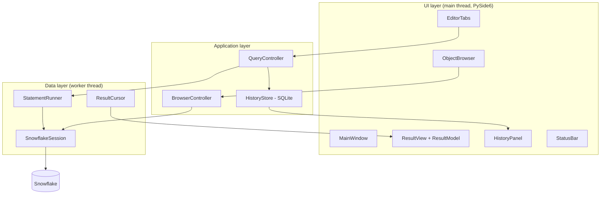
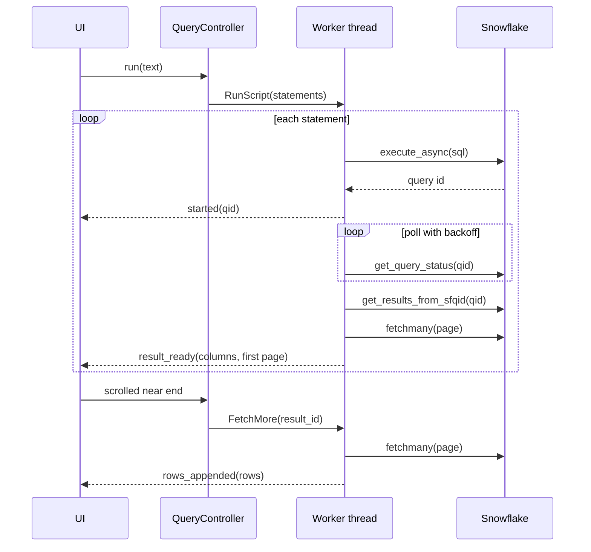

# SnowDesk: a lightweight macOS client for Snowflake

**Specification and implementation plan**
Stack: Python 3.12, `snowflake-connector-python`, PySide6 (Qt 6)
Status: Draft v1

---

## 1. Summary

SnowDesk is a small native-feeling desktop app for running SQL against Snowflake from a Mac. It replaces day-to-day SnowSQL usage with a query editor, a results grid, and a schema browser, while reusing the connection configuration the user already has for the `snow` CLI.

The app talks to Snowflake through the official Python connector, not by wrapping a CLI. That gives it one long-lived authenticated session, typed result metadata, incremental fetching, and real query cancellation.

## 2. Goals and non-goals

### Goals

The app should let a user pick a connection from `~/.snowflake/connections.toml`, authenticate once (password, key-pair, or SSO), and then write and run SQL with results appearing in a scrollable grid without freezing the UI. Long-running queries must be cancellable. The user should be able to browse databases, schemas, tables, and views, see the current role, warehouse, database, and schema at all times, and export or copy results. Query history should persist between launches.

### Non-goals (v1)

SnowDesk v1 does not try to replace Snowsight. It will not include dashboards, charts, query profiles, cost monitoring, worksheet sharing, Snowpark or notebook support, visual query building, data editing in the grid, or `PUT`/`GET` file transfer UI. It targets macOS only, although nothing in the design should make Linux or Windows ports hard later.

## 3. Users and core scenarios

The primary user is a data engineer or analyst who already uses SnowSQL or the `snow` CLI and has a working connection config.

| # | Scenario |
|---|----------|
| S1 | Open the app, pick the `default` connection, get connected (SSO opens the browser once, then the token is cached). |
| S2 | Write a query, press ⌘↩, see the first rows within a second or two of Snowflake returning, scroll to load more. |
| S3 | Run a script with several statements (`USE ROLE ...; USE WAREHOUSE ...; SELECT ...`) and see the session context update in the status bar. |
| S4 | Start a heavy query by mistake and cancel it with ⌘. (the query is actually cancelled in Snowflake, not just abandoned). |
| S5 | Expand a database in the sidebar, find a table, double-click to insert its name, right-click to preview 100 rows. |
| S6 | Export a result to CSV, or copy selected cells as TSV to paste into a spreadsheet. |
| S7 | Reopen the app next day and rerun a query from history. |

## 4. Functional requirements

Priority: **P0** is required for v1, **P1** is expected for v1 but can slip, **P2** is later.

### 4.1 Connections

| ID | Requirement | Pri |
|----|-------------|-----|
| C1 | Read connection names from the connector's `connections.toml` (same file as `snow` CLI) and list them in a picker. | P0 |
| C2 | Preselect the default connection (`default_connection_name` in `config.toml`, or `SNOWFLAKE_DEFAULT_CONNECTION_NAME`). | P0 |
| C3 | Support `snowflake` (password), `snowflake_jwt` (key-pair), and `externalbrowser` (SSO) authenticators as configured in the file. | P0 |
| C4 | Cache SSO tokens in the macOS Keychain so the browser flow is not repeated on every connect. | P0 |
| C5 | Keep the session alive while the app is open. | P0 |
| C6 | Show connection state (disconnected, connecting, connected, error) and allow reconnect. | P0 |
| C7 | Allow overriding role and warehouse at connect time from the UI. | P1 |
| C8 | Create or edit connections from within the app. | P2 |

### 4.2 Query execution

| ID | Requirement | Pri |
|----|-------------|-----|
| Q1 | Run the whole editor contents (⌘⇧↩) or the current selection / statement under the cursor (⌘↩). | P0 |
| Q2 | Split multi-statement input into individual statements and run them in order, stopping on first error. | P0 |
| Q3 | Execute without blocking the UI; show elapsed time and the Snowflake query ID while running. | P0 |
| Q4 | Cancel the running statement server-side (⌘.). | P0 |
| Q5 | Surface Snowflake errors with error code, message, SQL state, and query ID; highlight the failing statement. | P0 |
| Q6 | Show rows affected / status message for DML and DDL. | P0 |
| Q7 | Tag all queries with a `QUERY_TAG` so they are easy to find in Snowflake query history. | P1 |
| Q8 | Show the result of each statement in a multi-statement run as a separate result tab. | P1 |
| Q9 | Link out to the query in Snowsight for profiling. | P2 |
| Q10 | Show the session's commit mode and any open transaction in the status bar; switch between auto-commit and manual commit, and commit or roll back, from there. Ask before disconnecting, reconnecting or quitting with a transaction open. | P1 |

### 4.3 Results

| ID | Requirement | Pri |
|----|-------------|-----|
| R1 | Display results in a grid with column names and a type hint per column. | P0 |
| R2 | Fetch rows incrementally (default page 500 rows) as the user scrolls. | P0 |
| R3 | Render NULL distinctly from empty string; render timestamps with time zone; render VARIANT/OBJECT/ARRAY as compact JSON. | P0 |
| R4 | Cap rows held in memory (default 100,000, configurable) and tell the user when the cap is hit. | P0 |
| R5 | Copy selected cells as TSV; copy with headers. | P0 |
| R6 | Export the full result (not just loaded rows) to CSV, streaming to disk. | P1 |
| R7 | Client-side sort and filter of loaded rows. | P1 |
| R8 | Cell detail panel for long values and pretty-printed JSON. | P1 |
| R9 | Export to Parquet / XLSX. | P2 |

### 4.4 Object browser

| ID | Requirement | Pri |
|----|-------------|-----|
| B1 | Tree of databases → schemas → tables / views, loaded lazily on expand. | P0 |
| B2 | Expanding a table shows its columns and types. | P1 |
| B3 | Double-click inserts the fully qualified, correctly quoted name into the editor. | P1 |
| B4 | Context menu: preview 100 rows, copy name, generate `SELECT` statement, show DDL (`GET_DDL`). | P1 |
| B5 | Refresh a node; filter the tree by name. | P1 |

### 4.5 Editor, history, settings

| ID | Requirement | Pri |
|----|-------------|-----|
| E1 | Monospace SQL editor with syntax highlighting and line numbers. | P0 |
| E2 | Multiple editor tabs; unsaved content restored on relaunch. | P1 |
| E3 | Open / save `.sql` files. | P1 |
| E4 | Keyword and object-name autocompletion from the browser cache. | P2 |
| H1 | Persist every executed statement with timestamp, connection, duration, status, row count, query ID. | P0 |
| H2 | Searchable history panel; right-click copies a statement to the clipboard. | P1 |
| S1 | Preferences: page size, row cap, font size, light/dark following system. | P1 |

## 5. Non-functional requirements

**Responsiveness.** The UI thread never performs network I/O. Typing and scrolling stay smooth while a query runs or rows are being fetched.

**Memory.** With the default row cap, the app should stay under roughly 1 GB for typical result widths. Rows are stored as tuples, not dicts or DataFrames.

**Security.** The app never stores passwords or private-key passphrases itself; they stay in `connections.toml` (which must be `chmod 600`) or in the Keychain via the connector's own token cache. Query history is stored locally and can be cleared. No telemetry.

**Compatibility.** macOS 13+ on Apple silicon for v1. Intel builds are optional.

**Robustness.** A dropped network or expired session produces a clear error and a one-click reconnect, never a crash or a hang.

## 6. Architecture

### 6.1 Layers



The UI layer only emits intents ("run this text", "load more rows", "cancel") and renders state. The application layer turns intents into jobs for the data layer and routes results back through Qt signals. The data layer owns the Snowflake connection and is the only code that imports `snowflake.connector`.

### 6.2 Threading model

All Snowflake calls run on a single dedicated `QThread` that owns the connection, fed by a job queue. One worker keeps the model simple: the connector object is only touched by one thread for normal work, and ordering of `USE` statements and fetches is guaranteed.

Cancellation is the one exception. Because statements are submitted with `execute_async`, the connection is not blocked while Snowflake works, so a short-lived cancel job can run `SELECT SYSTEM$CANCEL_QUERY(<qid>)` on a separate cursor without waiting behind the running statement. The worker's polling loop then observes the cancelled status and ends the job.

Signals from worker to UI always carry plain Python data (lists of tuples, small dataclasses), never live cursor objects.

### 6.3 Statement lifecycle



## 7. Key design decisions

### 7.1 Reuse `connections.toml`

The connector's `connect(connection_name=...)` resolves the same config file the `snow` CLI uses, so SnowDesk does not invent its own connection format. The app reads connection names by loading the connector's config (or parsing the TOML directly with `tomllib` as a fallback) purely to populate the picker; actual connection parameters are left to the connector to resolve.

### 7.2 Session setup

```python
import snowflake.connector

def open_connection(name: str, role: str | None = None, warehouse: str | None = None):
    overrides = {k: v for k, v in {"role": role, "warehouse": warehouse}.items() if v}
    return snowflake.connector.connect(
        connection_name=name,
        client_session_keep_alive=True,
        client_store_temporary_credential=True,   # cache SSO id token in Keychain
        session_parameters={"QUERY_TAG": "snowdesk"},
        **overrides,
    )
```

SSO token caching also requires the account parameter `ALLOW_ID_TOKEN = TRUE` to be enabled by an account admin. The app should detect repeated browser prompts and show a hint pointing to this.

### 7.3 Statement splitting

Use the connector's own splitter (`snowflake.connector.util_text.split_statements`) rather than a homegrown one. It already understands quotes, comments, and `$$`-delimited bodies, and it flags `PUT`/`GET` statements, which cannot be run with `execute_async` and are executed synchronously instead.

### 7.4 Asynchronous execution and cancellation

```python
import time
from snowflake.connector import SnowflakeConnection

class StatementRunner:
    def __init__(self, conn: SnowflakeConnection):
        self.conn = conn

    def run(self, sql: str, on_started) -> "snowflake.connector.cursor.SnowflakeCursor":
        cur = self.conn.cursor()
        cur.execute_async(sql)
        qid = cur.sfqid
        on_started(qid)

        delay = 0.1
        while True:
            # raises ProgrammingError if the query failed or was cancelled
            status = self.conn.get_query_status_throw_if_error(qid)
            if not self.conn.is_still_running(status):
                break
            time.sleep(delay)
            delay = min(delay * 1.5, 1.0)

        cur.get_results_from_sfqid(qid)
        return cur

    def cancel(self, qid: str) -> None:
        self.conn.cursor().execute("SELECT SYSTEM$CANCEL_QUERY(%s)", (qid,))
```

A cancelled query surfaces as a `ProgrammingError` in the polling loop; the controller maps that specific case to a "Cancelled" status rather than an error dialog.

### 7.5 Incremental results

The grid is backed by a `QAbstractTableModel` that implements `canFetchMore` / `fetchMore`. Qt calls `fetchMore` when the user scrolls near the bottom; the model does not fetch itself but asks the controller, which schedules a `fetchmany` job on the worker and appends rows when they arrive.

```python
from PySide6.QtCore import QAbstractTableModel, QModelIndex, Qt, Signal

class ResultModel(QAbstractTableModel):
    more_requested = Signal()

    def __init__(self, columns, first_rows, exhausted, row_cap):
        super().__init__()
        self._columns = columns          # list[ColumnInfo]
        self._rows = list(first_rows)    # list[tuple]
        self._exhausted = exhausted
        self._loading = False
        self._row_cap = row_cap

    def rowCount(self, parent=QModelIndex()):
        return 0 if parent.isValid() else len(self._rows)

    def columnCount(self, parent=QModelIndex()):
        return 0 if parent.isValid() else len(self._columns)

    def data(self, index, role=Qt.DisplayRole):
        if role == Qt.DisplayRole:
            return format_cell(self._rows[index.row()][index.column()],
                               self._columns[index.column()])
        return None

    def canFetchMore(self, parent=QModelIndex()):
        return (not parent.isValid() and not self._exhausted
                and not self._loading and len(self._rows) < self._row_cap)

    def fetchMore(self, parent=QModelIndex()):
        self._loading = True
        self.more_requested.emit()

    def append_rows(self, rows, exhausted):
        self._loading = False
        self._exhausted = exhausted
        if not rows:
            return
        first = len(self._rows)
        self.beginInsertRows(QModelIndex(), first, first + len(rows) - 1)
        self._rows.extend(rows)
        self.endInsertRows()
```

The worker keeps the live cursor in a registry keyed by a result ID and closes it when the result tab is closed or a new run replaces it.

### 7.6 Session context display

After each statement the worker reads `conn.role`, `conn.warehouse`, `conn.database`, and `conn.schema`, which the connector updates from Snowflake's responses, and emits a `context_changed` signal for the status bar. If any value looks stale in testing, fall back to `SELECT CURRENT_ROLE(), CURRENT_WAREHOUSE(), CURRENT_DATABASE(), CURRENT_SCHEMA()`.

### 7.6.1 Commit mode

The status bar's last segment shows `Auto-commit`, `Manual commit`, or `● Transaction open · 4m`, and opens a menu (also under Query) to switch mode, commit, or roll back. It reflects what the session reports, not what SnowDesk last asked for: a script can `ALTER SESSION SET AUTOCOMMIT` or `BEGIN` on its own, `connections.toml` can set `autocommit`, and DDL commits implicitly. So the worker reads `SELECT CURRENT_TRANSACTION()` after connecting, after every run, and after a Commit or Roll back, and reads `SHOW PARAMETERS LIKE 'AUTOCOMMIT' IN SESSION` after connecting, after a mode switch, and after any script that mentions `autocommit`.

Commit and Roll back run as their own worker job rather than as a script, so they do not clear the result tabs the user was checking; they are still logged in Messages and recorded in History. The mode is never changed while a transaction is open: the UI asks to commit or roll back first, and the worker re-checks and refuses if one is still open. The choice lasts for the session only.

Disconnect, Reconnect and quitting ask Commit / Roll Back / Cancel when a transaction is open, and queue the answer ahead of the disconnect or shutdown job. A lost connection cannot ask, so its banner says the transaction was not committed.

### 7.7 Object browser queries

The browser uses `SHOW DATABASES`, `SHOW SCHEMAS IN DATABASE <db>`, `SHOW OBJECTS IN SCHEMA <db>.<schema>`, and `SHOW COLUMNS IN TABLE <fqn>`, one level at a time on expand. Results are cached per node with a manual refresh. Identifiers are quoted only when needed (not all-uppercase alphanumeric/underscore), using a single `quote_ident` helper that is unit-tested.

### 7.8 Local storage

History lives in SQLite at `~/Library/Application Support/SnowDesk/history.db`. Preferences and window geometry use `QSettings`. Editor tab contents are autosaved to the same support folder every few seconds.

## 8. UI specification

```
┌───────────────────────────────────────────────────────────────────────────┐
│ [Connection: default ▾] [Role ▾] [Warehouse ▾]   ● Connected   [Run][Stop]│
├───────────────┬───────────────────────────────────────────────────────────┤
│ Objects  [⟳]  │  query1.sql ×  │ Untitled 2 ×  │ +                        │
│ [filter…]     │ ┌───────────────────────────────────────────────────────┐ │
│ ▸ ANALYTICS   │ │ 1  select *                                           │ │
│ ▾ RAW         │ │ 2  from raw.public.orders                             │ │
│   ▾ PUBLIC    │ │ 3  where order_date > dateadd(day, -7, current_date);  │ │
│     ▸ ORDERS  │ └───────────────────────────────────────────────────────┘ │
│     ▸ USERS   │ ─────────────────────── splitter ───────────────────────  │
│               │  Result 1 │ Result 2 │ Messages │ History                 │
│               │ ┌──────────┬──────────────┬───────────┬───────────────┐   │
│               │ │ ORDER_ID │ ORDER_DATE   │ AMOUNT    │ PAYLOAD       │   │
│               │ │ NUMBER   │ DATE         │ NUMBER    │ VARIANT       │   │
│               │ ├──────────┼──────────────┼───────────┼───────────────┤   │
│               │ │ 1001     │ 2026-09-10   │ 42.50     │ {"sku":"A1"}  │   │
│               │ └──────────┴──────────────┴───────────┴───────────────┘   │
├───────────────┴───────────────────────────────────────────────────────────┤
│ ANALYST · WH_XS · RAW.PUBLIC │ 500 of ? │ 1.84 s │ 01b2…c9 │ Auto-commit  │
└───────────────────────────────────────────────────────────────────────────┘
```

Keyboard shortcuts: ⌘↩ run statement or selection, ⌘⇧↩ run all, ⌘. cancel, ⌘T new tab, ⌘W close tab, ⌘O / ⌘S open and save, ⌘⇧C copy with headers, ⌘E export.

The Messages tab shows per-statement status lines (success, rows affected, errors with query ID). The row count shows "500 of ?" while more rows may exist and "12,340 rows" once exhausted, using `cursor.rowcount` when the connector reports it.

## 9. Error handling

| Situation | Behaviour |
|-----------|-----------|
| Connection config missing or unreadable | Empty-state screen explaining where `connections.toml` lives, with a button to open the folder. |
| Authentication failure | Error banner with the connector message; connection stays disconnected; Retry button. |
| SQL compile / runtime error | Messages tab shows code, message, query ID; editor underlines the failing statement; remaining statements are skipped. |
| Query cancelled | Neutral "Cancelled" status, no dialog. |
| Session expired / network lost | Mark disconnected, keep editor state, offer Reconnect; in-flight jobs fail cleanly. |
| Row cap reached | Inline notice in the grid footer offering Export to CSV for the full result. |
| Unexpected exception in worker | Logged with traceback to `~/Library/Logs/SnowDesk/`, shown as a generic error, worker stays alive. |

## 10. Project layout

```
snowdesk/
├── pyproject.toml
├── src/snowdesk/
│   ├── __main__.py            # entry point
│   ├── app.py                 # QApplication setup, theme, logging
│   ├── config.py              # connection discovery, preferences
│   ├── db/
│   │   ├── session.py         # SnowflakeSession: connect, reconnect, context
│   │   ├── runner.py          # StatementRunner: split, async run, cancel
│   │   ├── results.py         # ResultCursor registry, fetch pages, type info
│   │   ├── browser.py         # SHOW queries, identifier quoting
│   │   └── worker.py          # QThread + job queue + signals
│   ├── controllers/
│   │   ├── query.py
│   │   └── browser.py
│   ├── storage/
│   │   └── history.py         # SQLite history store
│   ├── ui/
│   │   ├── main_window.py
│   │   ├── editor.py          # QPlainTextEdit + line numbers
│   │   ├── highlighter.py     # QSyntaxHighlighter for Snowflake SQL
│   │   ├── result_view.py     # QTableView + ResultModel
│   │   ├── object_tree.py
│   │   ├── history_panel.py
│   │   └── dialogs.py
│   └── util/
│       ├── formatting.py      # cell rendering
│       └── export.py          # CSV streaming, clipboard TSV
├── tests/
│   ├── unit/
│   ├── ui/                    # pytest-qt
│   └── integration/           # real Snowflake, opt-in
└── packaging/
    ├── snowdesk.spec          # PyInstaller
    └── entitlements.plist
```

Tooling: `uv` for environments and locking, `ruff` for lint and format, `mypy` in strict-ish mode for `db/` and `controllers/`, `pytest` with `pytest-qt`.

## 11. Testing strategy

**Unit tests** cover identifier quoting, cell formatting for every Snowflake type family, statement splitting edge cases (strings with semicolons, `$$` blocks, comments), history store queries, and CSV export. The `db/` layer is written against a small protocol so tests can inject a fake connection that simulates running, succeeded, failed, and cancelled statuses.

**UI tests** with `pytest-qt` drive the main window with the fake data layer: run a query, assert rows appear, scroll to trigger `fetchMore`, press cancel, check status bar updates.

**Integration tests** run against a real Snowflake account when `SNOWDESK_IT_CONNECTION` is set, using a throwaway schema created and dropped per run. They cover connect, multi-statement scripts with `USE`, a query large enough to span multiple result chunks, cancellation of a `SELECT SYSTEM$WAIT(30)`, and error reporting. Keep these out of the default test run. The third-party `fakesnow` library (which emulates Snowflake on DuckDB) is worth evaluating for faster local SQL-level tests, with the caveat that it will not reproduce async status or cancellation behaviour.

**Manual checklist** before each release: SSO first login and cached relogin, key-pair auth, sleep/wake with an open session, Wi-Fi off mid-query, dark mode, a 100k-row result.

## 12. Packaging and distribution

Build a `.app` bundle with PyInstaller (Briefcase is a reasonable alternative). The connector ships compiled extensions and Arrow-related components, so the PyInstaller spec will likely need hidden imports and data files added; validate this early rather than at the end (see M0). Sign with a Developer ID certificate using the hardened runtime, notarize with `xcrun notarytool`, and staple the ticket. Distribute as a `.dmg`. For personal use only, an unsigned build run with `uv run snowdesk` is perfectly fine and skips all of this.

## 13. Implementation plan

Estimates assume one developer familiar with Python and new-ish to Qt. Total is roughly 12 to 15 focused days.

### M0: Skeleton and risk spike (1 day)

Set up the repo, `pyproject.toml`, `uv`, `ruff`, `pytest`, and CI. Create an empty `QMainWindow` that launches with `python -m snowdesk`. Do a throwaway PyInstaller build that imports `snowflake.connector` and PySide6 and connects to Snowflake from the bundled app, to surface packaging issues on day one.

*Exit criteria:* an app bundle opens a window and prints `CURRENT_VERSION()` from Snowflake to the log.

### M1: Connection layer (1.5 days)

Implement connection discovery (C1, C2), `SnowflakeSession` with connect, disconnect, reconnect, and context reading (C3 to C6), and the worker thread with its job queue and signals. Build the toolbar connection picker and status bar.

*Exit criteria:* password, key-pair, and SSO connections all work from the picker; second SSO launch does not open the browser (with `ALLOW_ID_TOKEN` on); status bar shows role, warehouse, database, schema.

### M2: Query engine (2 days)

Implement statement splitting, `StatementRunner` with async execution and backoff polling, synchronous fallback for `PUT`/`GET`, cancellation, and error mapping (Q1 to Q6, Q7). Add the Messages tab.

*Exit criteria:* a three-statement script with `USE` runs in order and updates context; a failing middle statement stops the run with a clear message; `SELECT SYSTEM$WAIT(60)` can be cancelled and shows as cancelled in Snowsight's query history.

### M3: Results grid (2.5 days)

Build `ResultModel` and `ResultView` with incremental fetching, the result cursor registry, type-aware cell formatting, NULL styling, row cap, and copy as TSV (R1 to R5). Add one result tab per statement (Q8).

*Exit criteria:* a query over a large table (for example `SNOWFLAKE_SAMPLE_DATA.TPCH_SF1.LINEITEM`) shows first rows quickly, scrolling loads more without UI stutter, memory stays flat once the cap is reached, and VARIANT and timestamp columns render correctly.

### M4: Editor experience (1.5 days)

Build the editor with line numbers and syntax highlighting (E1), tabs with autosave and restore (E2), file open/save (E3), "run statement under cursor", and keyboard shortcuts.

*Exit criteria:* all shortcuts in section 8 work; quitting and relaunching restores tab contents.

### M5: Object browser (2 days)

Build the lazy tree, column expansion, identifier quoting, filter, refresh, and context menu actions (B1 to B5).

*Exit criteria:* an account with many databases stays responsive; mixed-case and quoted identifiers are inserted correctly; Preview runs in a new result tab.

### M6: History, export, preferences (1.5 days)

Build the SQLite history store and panel (H1, H2), streaming CSV export of full results (R6), client-side sort (R7), cell detail panel (R8), and preferences dialog (S1).

*Exit criteria:* a 1-million-row export completes without holding rows in memory; history search finds a statement by substring; preferences persist.

### M7: Hardening and release (1.5 to 2 days)

Handle network loss and session expiry paths, add logging, finish integration tests, run the manual checklist, then sign, notarize, and produce the `.dmg`.

*Exit criteria:* all P0 requirements met; manual checklist passes; notarized build opens on a clean Mac without Gatekeeper warnings.

### Timeline at a glance

| Milestone | Days | Cumulative |
|-----------|------|------------|
| M0 Skeleton and spike | 1 | 1 |
| M1 Connection layer | 1.5 | 2.5 |
| M2 Query engine | 2 | 4.5 |
| M3 Results grid | 2.5 | 7 |
| M4 Editor | 1.5 | 8.5 |
| M5 Object browser | 2 | 10.5 |
| M6 History, export, prefs | 1.5 | 12 |
| M7 Hardening and release | 2 | 14 |

A usable personal tool exists after M3 (about a week). M4 onward is polish and convenience.

## 14. Risks and open questions

| Risk / question | Mitigation |
|-----------------|------------|
| PyInstaller bundling of the connector's native pieces breaks | Spike in M0; pin versions; consider Briefcase if blocked. |
| SSO prompts on every launch | Requires `ALLOW_ID_TOKEN` at account level; detect and show guidance. |
| Polling adds latency for very fast queries | Start polling at 100 ms; optionally run statements that look trivial synchronously. |
| Connector behaviour when a cancel runs concurrently with a fetch on the same connection | Cover in integration tests; if problematic, open a second lightweight connection dedicated to cancels. |
| Very wide results (hundreds of columns) slow the grid | Uniform row heights, lazy column width calculation, cap initial column width. |
| Should autocompletion (E4) use a real SQL parser? | Defer to v2; start with keyword plus cached object names. |
| Intel Mac support needed? | Decide before M7; a second build on an Intel runner is the simplest answer. |

## 15. Future ideas (v2+)

Autocompletion, charts for simple result shapes, a query profile link and basic cost display per query (from `QUERY_HISTORY`), saved snippets, Parquet/XLSX export, a stage browser with `PUT`/`GET`, and optional Linux/Windows builds.
